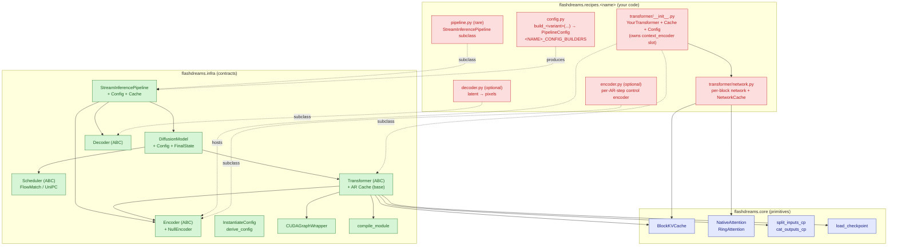
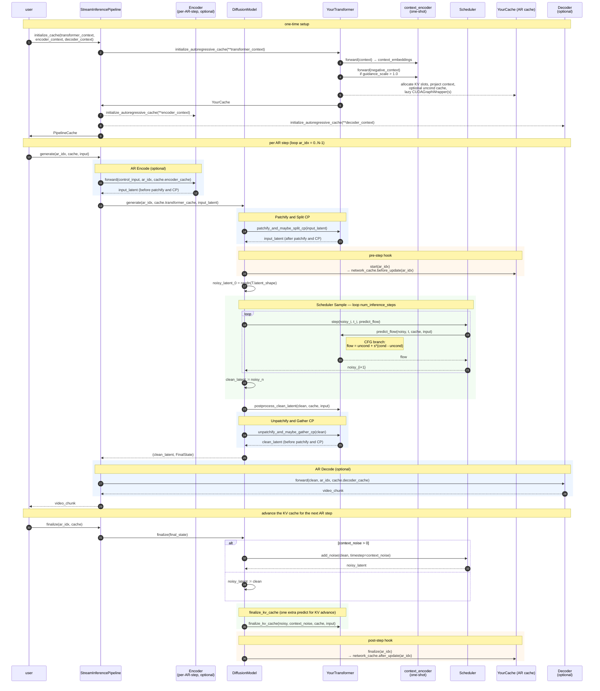

# flashdreams recipe architecture

Read before adding a recipe under `flashdreams/flashdreams/recipes/` or making a structural change to an existing one. The goal: place code in the correct layer, fulfil the right contracts, and stay consistent with `recipes/template/` — the reference recipe that exercises every framework contract end-to-end.

Keep docstrings consistent with the `python-docstring-style` skill.

## 1. Three-layer mental model

```
flashdreams/
├── core/        reusable primitives (no recipe-specific code)
├── infra/       framework contracts + orchestration code (ABCs + base configs)
└── recipes/     concrete model bindings that satisfy the infra contracts
```

**`core/`** — shared numerical building blocks. Never imports from `recipes/`. Includes `attention/` (`NativeAttention`, `RingAttention`, `BlockKVCache`), `checkpoint/load.py`, `distributed/` (`split_inputs_cp`, `cat_outputs_cp`, `*_object_list`), `io/`.

**`infra/`** — the framework. ABCs, protocols, orchestration, pipeline wiring. Defines the contracts every recipe satisfies:

- `infra.config` — `InstantiateConfig[T]`, `derive_config`, `PrintableConfig`.
- `infra.pipeline` — `StreamInferencePipeline`, `StreamInferencePipelineConfig`, `StreamInferencePipelineCache`.
- `infra.diffusion.{model, scheduler, transformer}` — `DiffusionModel`, `Scheduler` ABC (`FlowMatch*` implementations), `Transformer` ABC + `TransformerAutoregressiveCache`.
- `infra.encoder`, `infra.decoder` — `Encoder`/`Decoder` ABCs and `NullEncoder` (identity; always-on plug-point stub).
- `infra.compile` — `compile_module(..., mode="max-autotune-no-cudagraphs")`.
- `infra.cuda_graph` — `CUDAGraphWrapper` with `warmup / drain / __call__ / reset`.
- `infra.profiler` — `EventProfiler`.

**`recipes/<name>/`** — concrete models. One model family per recipe. `recipes/template/` is the minimal reference; treat it as the design source of truth.

### When in doubt about layer

| Question | Layer |
|---|---|
| New attention variant or shared CUDA utility? | `core/` |
| Reusable text/image encoder any recipe could use? | `infra/encoder/<kind>/` |
| New ABC or generic orchestrator? | `infra/` |
| Model-specific DiT, control encoder, or VAE? | `recipes/<name>/` |
| CLI entry points, profiling scripts? | `run_*.py` under the recipe |

Never add recipe-specific branching to `infra/` or `core/`; expose another slot or override instead.

## 2. What a recipe owns vs what infra gives you

Green = `core/` + `infra/` (inherit or compose). Red = recipe-authored. Solid = containment, dashed = subclass.



**Minimum viable recipe** (matches `recipes/template/`):

- `transformer/__init__.py` — `YourTransformer(Transformer[YourTransformerCache])`, `YourTransformerCache(TransformerAutoregressiveCache)`, `YourTransformerConfig(InstantiateConfig[YourTransformer])`.
- `transformer/network.py` — the per-block network + its `NetworkCache` / `NetworkConfig`.
- `config.py` — one `build_*(...) -> StreamInferencePipelineConfig`.

`pipeline.py` is only required when you need a custom `initialize_cache` signature; `encoder.py` / `decoder.py` are only required when you own those stages. Text / CLIP-image encoders plug into `YourTransformerConfig.context_encoder` (see §5.2 and §6.3), not a new pipeline subclass.

## 3. Recipe package layout

The template layout is the minimum; richer recipes add more:

```
recipes/<name>/
├── __init__.py              usually empty
├── config.py                build_<variant>(...) → PipelineConfig; <NAME>_CONFIG_BUILDERS
├── transformer/
│   ├── __init__.py          Transformer subclass + Cache + Config
│   └── network.py           per-block network + NetworkCache (or impl/ subpackage if split)
├── encoder.py               per-AR-step control encoder (optional)
├── decoder.py               VAE / projection decoder (optional)
├── pipeline.py              StreamInferencePipeline subclass (optional, rare)
└── constants.py             checkpoint URIs / prompts (optional)
```

Variants:

- Many trained sizes → split `config.py` into a `config/` package (one file per variant).
- Complex network → split `transformer/network.py` into `transformer/impl/` with `modules.py`, `network.py`, `rope.py`, etc.
- Decoder-only recipe (e.g. standalone VAE) → export a `Decoder` subclass and config; skip `transformer/`, `pipeline.py`, `config.py`.

## 4. Rollout call chain

One rollout = `initialize_cache` → N × (`generate` + `finalize`). Bidirectional case is N = 1; streaming AR is N ≥ 2. One-shot context (text prompts, reference frames) is encoded inside the transformer's `initialize_autoregressive_cache` via `context_encoder`. The per-AR-step `encoder` runs once per AR step; the `decoder` runs once per AR step on the clean latent.



### Shape boundaries

Two disjoint shape regimes, separated by `patchify_and_maybe_split_cp`:

- **Before patchify / gather**: everything the user, pipeline, encoder, and decoder see. Canonical layout `[B, C, T, H, W]` for video, `[B, N_ctx, D]` for context tokens.
- **After patchify / split**: everything the network and scheduler touch. Canonical layout `[B, L/cp_size, C]` with `L = T*H*W`.

The patchify hooks are the *only* place that boundary crosses. Never split or gather at a call site.

## 5. The contracts a recipe must fulfil

Scaffold in dependency order.

### 5.1 Transformer (always required)

Subclass `flashdreams.infra.diffusion.transformer.Transformer[YourCache]`. Must implement:

- `latent_shape` (property): **per-rank** shape of the tensor `DiffusionModel.generate` will allocate noise at. Must already reflect CP sharding.
- `predict_flow(noisy_latent, timestep, cache, input=None) -> Tensor`: one flow-match forward on the patchified latent, with CFG merge when `cache.network_cache_uncond` is populated.
- `patchify_and_maybe_split_cp(x)` / `unpatchify_and_maybe_gather_cp(x)`: inverse pair mapping between the two shape regimes.
- `initialize_autoregressive_cache(**transformer_context) -> YourCache`: build the per-rollout cache (encode context, allocate KV buffers, lazy-build `CUDAGraphWrapper`s).

Optional overrides:

- `postprocess_clean_latent(clean, cache, input)`: stamp known regions into predicted `x0` (e.g. I2V first-frame pinning). Default identity.
- `finalize_kv_cache(...)`: default runs one extra `predict_flow`; override for dual-network DiTs or to honour `skip_finalize_kv_cache`.

Your cache subclass hoists KV pre/post-updates out of the (potentially graph-captured) forward:

```python
@dataclass(kw_only=True)
class YourTransformerCache(TransformerAutoregressiveCache):
    network_cache: YourNetworkCache
    network_cache_uncond: YourNetworkCache | None = None  # CFG off when None
    autoregressive_index: int = -1

    def start(self, autoregressive_index: int) -> None:
        self.autoregressive_index = autoregressive_index
        self.network_cache.before_update(autoregressive_index)
        if self.network_cache_uncond is not None:
            self.network_cache_uncond.before_update(autoregressive_index)

    def finalize(self, autoregressive_index: int) -> None:
        self.network_cache.after_update(autoregressive_index)
        if self.network_cache_uncond is not None:
            self.network_cache_uncond.after_update(autoregressive_index)
```

### 5.2 Transformer config (the context_encoder slot)

Every transformer config owns two encoder-shaped knobs that are easy to confuse:

- `context_encoder: InstantiateConfig[Encoder]` — **one-shot**, runs inside `initialize_autoregressive_cache`. Turns raw context (prompts, reference frames) into `context_embeddings`. Defaults to `NullEncoderConfig()` (identity) so pre-shaped tensors pass straight through; plug a text or CLIP image encoder here.
- `network: YourNetworkConfig` — the underlying per-block network.

Other knobs the template config standardises (all optional to inherit; keep names stable for tooling):

- `dtype`, `checkpoint_path` (`None` → random init), `guidance_scale`, `len_t`, `window_size_t`, `sink_size_t`, `compile_network`, `use_cuda_graph`, `cuda_graph_warmup_iters`.
- A property `requires_negative_context_embeddings` → `guidance_scale > 1.0`, for assertion at cache build time.

### 5.3 Per-AR-step Encoder (optional)

Subclass `flashdreams.infra.encoder.Encoder[YourEncoderCache]` when you need a *per-AR-step* control input (HDMap, camera control, first-frame VAE for I2V). Contract:

- `forward(input, autoregressive_index=0, cache=None) -> Tensor` — output is in the pre-patchify regime.
- `initialize_autoregressive_cache(**encoder_context) -> YourEncoderCache` — return a fresh cache even when stateless (`EncoderAutoregressiveCache()`).

Set `encoder=None` in the pipeline config to disable; `pipeline.generate(input=None)` then round-trips.

### 5.4 Decoder (optional)

Subclass `flashdreams.infra.decoder.Decoder[YourDecoderCache]` for the final latent → pixel stage. Same shape as `Encoder`: input is a clean latent, output is pixels. `decoder=None` returns the unpatchified clean latent directly (training, latent eval).

### 5.5 Pipeline (rare)

The base `StreamInferencePipeline` is concrete and sufficient for the template and most recipes. Subclass only when you need a custom `initialize_cache` signature that wraps caller inputs (e.g. `text: list[list[str]]`, reference image) into the generic `transformer_context` / `encoder_context` / `decoder_context` dicts before forwarding.

If none of that applies, use `StreamInferencePipelineConfig` directly and plug encoders into the slots provided (`pipeline.encoder`, `pipeline.decoder`, `transformer.context_encoder`).

When subclassing, mirror the template:

```python
@dataclass(kw_only=True)
class YourPipelineConfig(StreamInferencePipelineConfig):
    _target: type["YourPipeline"] = field(default_factory=lambda: YourPipeline)

YourPipelineCache: TypeAlias = StreamInferencePipelineCache[
    YourEncoderCache, YourTransformerCache, YourDecoderCache,
]
```

### 5.6 Configs and builders

- Every config is `@dataclass(kw_only=True)` extending `InstantiateConfig[Target]` with `_target = field(default_factory=lambda: Target)`. Never use a bare instance as a default — always `field(default_factory=...)`.
- Use `__post_init__` for cross-field validation and computing derived quantities.
- Write `build_<variant>(...) -> StreamInferencePipelineConfig` (or your subclass) in `config.py`. Keyword-only, sensible defaults.
- Register all builders in `<NAME>_CONFIG_BUILDERS: dict[str, Callable[..., ...]]` so downstream harnesses can enumerate them.
- **Prefer `derive_config(base, **changes)` over duplicating a builder body.** It deep-copies and applies nested patches:
  ```python
  derive_config(
      base,
      diffusion_model=dict(
          transformer=dict(guidance_scale=3.0),
          scheduler=dict(num_inference_steps=8),
      ),
  )
  ```
- Publish reusable derive-patches as helpers alongside the builders. The template ships `with_compile_and_cuda_graph(base)` for the compile + CUDA-graph fast path.

## 6. Cross-cutting conventions

### 6.1 Latent shape and patchify

Two common layouts:

- **Flat `[*batch_shape, L, D]`** with `L = T*H*W`. Simpler; CP splits along `L`. The template uses this.
- **Structured `[*batch_shape, V, T, HW, D]`** or similar. Needed for hierarchical CP groups (per-view × per-time × per-space).

Rules:

- `latent_shape` reports the **per-rank** shape — already CP-divided. It's populated by `initialize_autoregressive_cache` (spatial dims `H`, `W` are per-rollout args), so reading it before the cache is initialised must assert.
- `patchify_and_maybe_split_cp` is the *only* place CP splitting happens.
- When the encoder output is a struct (e.g. `ctrl_latent + mask`), patchify each field independently and return the same struct type — `DiffusionModel.generate` forwards opaquely.

### 6.2 Context parallelism

- **Auto-detect CP size** at transformer construction from `torch.distributed.get_world_size()`; fall back to `1` when not initialised. Don't duplicate `cp_size` on the recipe config — the launcher (`torchrun --nproc_per_node=N`) is the single source of truth.
- Use `split_inputs_cp(x, seq_dim=..., cp_group=...)` / `cat_outputs_cp(...)`; pass `cp_group=None` as the single-GPU no-op.
- For per-view lists (strings, view names), use the `_object_list` variants.
- Prefer `flashdreams.core.attention.RingAttention` over manual all-gather + SDPA — it fuses the cross-rank KV gather with SDPA via a log-sum-exp merge.
- Every divisibility assumption belongs at cache-build time or in `__post_init__`, with a readable message. Typical: `len_t * height * width % cp_size == 0`.

### 6.3 One-shot context vs per-AR-step encoder

| | one-shot `context_encoder` | per-AR-step `encoder` |
|---|---|---|
| **Slot** | `YourTransformerConfig.context_encoder` | `StreamInferencePipelineConfig.encoder` |
| **Runs** | once, inside `initialize_autoregressive_cache` | every AR step, inside `pipeline.generate` |
| **Input** | raw prompts / reference frames | per-step control (HDMap, camera, ...) |
| **Output** | `context_embeddings` for the full rollout | per-step latent in pre-patchify regime |
| **Disable** | `NullEncoderConfig()` (identity) | `encoder=None` |

Getting this wrong is a common pitfall: putting a text encoder on the per-AR-step slot re-runs it for every AR step.

### 6.4 Classifier-free guidance

- Store an optional `network_cache_uncond` on the per-rollout cache. `None` means CFG off.
- The `requires_negative_context_embeddings` property drives the assertion: CFG on implies a `negative_context` must be supplied at cache build time.
- In `predict_flow`, short-circuit to the cond branch when `network_cache_uncond is None`; otherwise return `flow_uncond + s * (flow_cond - flow_uncond)`.
- When wrapping the network in `CUDAGraphWrapper`, allocate **two independent wrapper instances** (one per branch) with identical `warmup_iters`. The residual stream diverges at the first context-bias addition so cond and uncond must not share static buffers.
- Only encode `negative_context` when CFG is actually on:

```python
if cfg.requires_negative_context_embeddings:
    assert negative_context is not None, "...guidance_scale > 1.0 requires negative_context."
    negative_context_embeddings = self.context_encoder(input=negative_context)
    network_cache_uncond = self.network.initialize_cache(..., context=negative_context_embeddings)
```

### 6.5 KV cache + CUDA graphs + `torch.compile`

`BlockKVCache` has two code paths — *filling* (append + slice) and *steady-state* (roll-left + overwrite). Dynamo traces each branch as a separate subgraph; each autotunes separately the first time it runs.

Contract for recipes that wrap the network in a `CUDAGraphWrapper`:

1. Compile with `compile_module(network)` — pins `mode="max-autotune-no-cudagraphs"`, so `torch.compile` does **not** manage its own CUDA graphs.
2. Wrap the compiled module in `CUDAGraphWrapper(network, warmup_iters=cfg.cuda_graph_warmup_iters)`. `warmup_iters >= 2` drains Inductor autotune on the eager path before capture.
3. **Build the wrapper lazily inside `initialize_autoregressive_cache`.** The graph captures against the current KV-cache pointers, so a fresh rollout (new H/W, new cache) needs a fresh wrapper. CFG → two wrappers.
4. Dispatch per AR step via a precomputed `_cuda_graph_capture_ar_idx` (named `_steady_ar_idx` in older recipes):
   ```python
   _cuda_graph_capture_ar_idx = (cfg.sink_size_t + cfg.window_size_t) // cfg.len_t
   ```
   AR steps `ar_idx < _cuda_graph_capture_ar_idx` go through `wrapper.drain` (eager — drains autotune AND exercises the cache's slice-returning filling path). AR steps `>= _cuda_graph_capture_ar_idx` go through `wrapper.__call__` (warmup → capture → replay).
5. Any buffer the captured graph writes through in-place (KV slots, staged outputs) must have a stable storage address across replays. `CUDAGraphWrapper` only stages top-level tensor args.

If you see `cudaErrorStreamCaptureUnsupported` or `operation not permitted when stream is capturing`, you're almost certainly autotune-firing inside capture — re-check the dispatch threshold and that `.drain` is used throughout the filling phase.

Because these wrappers are expensive to build and hold GPU buffers, the template defaults `compile_network=False` and `use_cuda_graph=False` and exposes `with_compile_and_cuda_graph(base)` as the opt-in patch.

### 6.6 Scheduler

Pick from `FlowMatchSchedulerConfig` (self-forcing, 1–4 step) or a UniPC variant (full 35–50 step bidirectional). Both live under `infra.diffusion.scheduler`. The scheduler config is a field on `DiffusionModelConfig`, not on the recipe or pipeline config.

### 6.7 Checkpoint loading

Use `flashdreams.core.checkpoint.load.load_checkpoint(path)`. Standard shape:

```python
if config.checkpoint_path is not None:
    state_dict = load_checkpoint(config.checkpoint_path)
    self.network.load_state_dict(state_dict)
```

Supply a `state_dict_transform` on your transformer config when upstream training adds a prefix (e.g. `net.`, `generator_ema.model.`). `checkpoint_path=None` keeps the random init — the right default for unit tests.

## 7. Testing conventions

- Tests live in **`flashdreams/tests/test_<recipe>.py`** — top-level `tests/`, not inside the recipe.
- `pytest`, plain helper functions; `@pytest.mark.parametrize` for seed / variant sweeps.
- Unit tests default to `checkpoint_path=None`, `compile_network=False`, `use_cuda_graph=False`. Flip the fast-path knobs in a dedicated equivalence test comparing against the eager baseline.
- CFG on/off is a `derive_config` patch on the base builder, not a separate builder.
- CP equivalence is a **two-invocation test**:
  1. Plain `pytest` (no distributed init) writes a reference tensor to `<tmpdir>/<recipe>/cp_reference.pt`.
  2. A `torchrun --nproc_per_node=N` launch re-runs the same deterministic inputs and asserts the gathered output matches.
  Run both in the same `srun` (or set a shared `*_CP_REF_PATH`) so they share `/tmp`.
- Smoke shape: construct the config, `.setup().to("cuda").eval()`, build inputs with `cfg.dtype`, run `>= 2` AR steps (covers filling + the first steady step when `window_size_t == 2 * len_t`), assert output shape / device / finiteness.

## 8. Scaffolding checklist

When adding a new recipe `foo`:

1. `recipes/foo/transformer/network.py` — per-block network + `FooNetworkCache` + `FooNetworkConfig`. Use `flashdreams.core.attention.RingAttention` for CP-aware attention.
2. `recipes/foo/transformer/__init__.py` — `FooTransformerConfig` (with `context_encoder: InstantiateConfig[Any] = NullEncoderConfig`, `checkpoint_path: str | None = None`, `compile_network=False`, `use_cuda_graph=False`, `cuda_graph_warmup_iters=2`), `FooTransformerCache`, `FooTransformer(Transformer[FooTransformerCache])`. Implement all five abstract members; auto-detect CP size.
3. (Optional) `recipes/foo/encoder.py` for per-AR-step control.
4. (Optional) `recipes/foo/decoder.py` for the final stage.
5. (Rare) `recipes/foo/pipeline.py` only if the base pipeline's `initialize_cache` signature doesn't fit.
6. `recipes/foo/config.py` — at least one `build_foo_<variant>(...) -> StreamInferencePipelineConfig`, a second derived variant via `derive_config`, a `FOO_CONFIG_BUILDERS` dict, and a `with_compile_and_cuda_graph(base)` helper if you want the fast path.
7. `flashdreams/tests/test_foo.py` — bidirectional + streaming smoke tests, CFG on/off via `derive_config`, no-control branch, compile + CUDA-graph equivalence, CP equivalence (two-invocation). Parametrise seed for determinism checks.

## 9. Common pitfalls

- **`latent_shape` returning the pre-CP (global) shape.** `DiffusionModel.generate` draws noise at this shape on this rank — must match the patchified latent after `split_inputs_cp`.
- **Reading `latent_shape` before `initialize_autoregressive_cache`.** Per-rollout `(batch_size, H, W)` is populated lazily; reading earlier must assert, not silently return stale / `None`-laden values.
- **Sharing one `CUDAGraphWrapper` across cond and uncond.** Capture fails or silently reuses stale activations. Allocate two.
- **Building the `CUDAGraphWrapper` in `__init__` instead of `initialize_autoregressive_cache`.** The graph binds to the first cache's KV pointers; the second rollout then reads stale storage. Rebuild per rollout.
- **`_cuda_graph_capture_ar_idx = chunks_total // len_t - 1`.** Off-by-one — that's the last filling step, not the first steady step.
- **`compile_network=True` with `mode="max-autotune"`.** `torch.compile` then owns its own CUDA graphs and conflicts with `CUDAGraphWrapper`. Always go through `compile_module`.
- **Bare instance as a `@dataclass` default.** Every pipeline config picks up the same mutable nested config; mutations leak between rollouts. Use `field(default_factory=...)`.
- **Recipe-specific imports in `infra/` or `core/`.** Breaks the dependency direction.
- **Plugging a text / CLIP-image encoder into the pipeline's per-AR-step `encoder` slot.** That slot runs every AR step. One-shot encoders go on `YourTransformerConfig.context_encoder` (see §6.3).
- **Hard-coding `cp_size` on the recipe config.** Auto-detect from `torch.distributed.get_world_size()` instead; the launcher is the single source of truth.
- **Unconditional `negative_context` encoding.** Only encode inside the `if cfg.requires_negative_context_embeddings:` branch so CFG-off rollouts don't pay for the extra pass.
- **Asserting shape on a raw input with no shape hint in the error message.** Different recipes feed different rank layouts; add an `ndim` + `.shape` hint in `patchify_and_maybe_split_cp`'s assertion.
